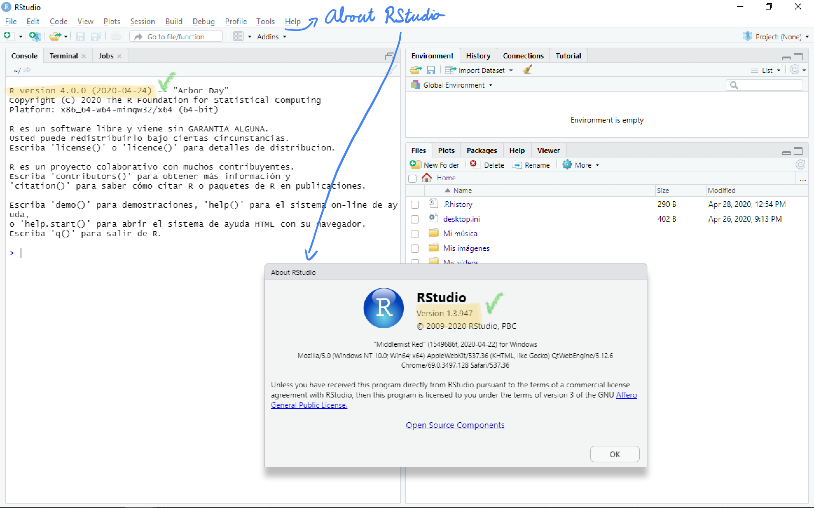

```{r setup, include=FALSE, purl=FALSE}
knitr::opts_chunk$set(echo = TRUE, results = "hide", eval=TRUE, warning = FALSE, message = FALSE, results = FALSE)
```

# Objetivo de la práctica {-}

El objetivo principal de esta práctica es familiarizarse con el software estadístico y lenguaje de programación R para realizar análisis estadístico de datos. Como objetivos secundarios tenemos: 

1. Instalar y configurar R y RStudio (si usamos nuestro ordenador)
2. Conocer los elementos básicos del lenguaje
3. Conocer las estructuras básicas de datos
4. Aprender a importar datos
5. Hacer operaciones básicas con datos
6. Crear informes reproducibles

En este documento encontrarás el código necesario para realizar la práctica.

:::{.rmdeval data-latex=""}

En esta práctica no hay que entregar nada.

:::

# Introducción

R es un 
sistema para **computación estadística**: software de **análisis de datos** y
**lenguaje de programación**. Ha sido ampliamente utilizado en investigación y docencia, 
y actualmente también 
en las empresas y organismos públicos. Es la evolución del trabajo de los laboratorios Bell con el 
lenguaje,
llevado al mundo del software libre por Ross Ihaka y Robert Gentleman en los años 90 (FOSS, Free and Open Sourse Software).
La version R 1.0.0 se publicó el 29 de febrero de 2000.

RStudio Desktop es un IDE (Integrated Development Environment) para R, que nos facilita mucho el trabajo con R. Es también software libre, aunque la compañía que lo creó, Posit, también ofrece productos con licencia comercial, además de otros servicios.

R es un lenguaje interpretado, lo que quiere decir que cada vez que le proporcionamos una expresión al intérprete, esta se evalúa y produce un resultado. Estas expresiones se pueden introducir directamente en la **consola** de R (evaluación interactiva) o bien a través de **scripts**, que son ficheros de texto plano con extensión .R donde escribimos las expresiones y se evalúan secuencialmente (enviándolas a la consola, o en bloque todo el script).

Las expresiones del script se pueden enviar a la consola para
ser evaluadas
una a una, en bloques, o todas a la vez. Las expresiones
seguirán el orden lógico del análisis de datos que queramos hacer, por ejemplo:

1. Cargar los paquetes que se vayan a utilizar
2. Importar los datos de algún fichero
3. Transformar, filtrar u organizar los datos 
4. Explorar los datos
5. Aplicar modelos estadísticos

Podemos ejecutar un script desde otro script. Por ejemplo, es muy útil si creamos nuestras propias funciones en un script, y en otro ejecutamos el análisis.

Las expresiones también se pueden escribir en ficheros "R Markdown",
en los cuales se pueden intercalar en bloques de texto con
formato, y así presentar los resultados y, opcionalmente,
el código, en forma de informes reproducibles.


# Instalación y configuración de R y RStudio

::: {.rmdinfo data-latex=""}

Si vas a utilizar el proyecto en Posit.cloud, sáltate este apartado y ve al apartado 4.

:::

Antes de empezar a analizar datos con R hay que seguir unos pasos para tener el entorno preparado:

1. Instalar el software "base" de R
2. Instalar el interfaz "RStudio"
3. Configurar las opciones de RStudio
4. Instalar paquetes adicionales
5. Crear un proyecto de RStudio
6. Actualizar programas y paquetes


El cuarto punto habrá que realizarlo cada vez que vayamos a utilizar
por primera vez un paquete en nuestra instalación. 
El quinto
punto lo realizaremos cada vez que tengamos un nuevo proyecto de análisis de datos.
El sexto punto es aconsejable realizarlo periódicamente. Hay usuarios
que prefieren tener todo el sistema completamente
actualizado. Otros usuarios prefieren actualizar paquetes y programas
solo cuando algo deja de funcionar. Un punto intermedio es una estrategia
bastante razonable, y en todo caso aconsejable: actualizar al menos una vez al año.


::: {.rmdinfo data-latex=""}
Tanto R como RStudio están instalados en **MyApps**, así como los paquetes que utilizaremos en las prácticas. No obstante, es recomendable que lo instaléis en vuestros ordenadores y trabajéis desde ahí.

IMPORTANTE: Al ejecutar RStudio desde MyApps, lo que se abre es un escritorio virtual, y desde ahí tenéis que buscar RStudio en los programas de Windows.
:::

## Instalación de R

Para instalar R, sigue los siguientes pasos:

1. Abrimos http://www.r-project.org y hacemos clic en **download R** 

2. Seleccionar servidor  
El enlace nos lleva primero a una página para seleccionar el _mirror_ desde
el que deseamos descargar R. R está distribuido en servidores de todo el mundo
de organizaciones que alojan el sistema. Podemos buscar los más cercanos (por ejemplo
en España hay dos), pero lo más cómodo es elegir el primero de todos, que automáticamente
nos redirige al más apropiado

3. Seleccionar el sistema operativo  
Hacemos clic en el enlace que se corresponda con nuestro sistema operativo
(Windows, Mac OS X o Linux), que nos llevará por caminos diferentes.

### Instalación en Windows {-}

1. Descargar el archivo de instalación  
Antes de mostrar el enlace para la descarga, nos muestra
los "subdirectorios". Hacemos clic en "base" y nos lleva a la página de 
descarga. Descargamos el archivo de instalación al ordenador.


2. Instalar R  
Una vez nuestro navegador ha terminado la descarga, buscamos el archivo de 
instalación (normalmente en la carpeta Descargas) y lo ejecutamos, aceptando
la advertencia de que se van a realizar cambios en el equipo.
Se abre el asistente de instalación, en el que sucesivamente nos solicita
el idioma de instalación y la ruta de instalación, y se pueden seleccionar otras
opciones de configuración si se selecciona "Sí" en el paso correspondiente.
Finalmente podemos añadir accesos directos. Para los efectos de esta asignatura,
**selecciona todas las opciones por defecto** en el asistente, que empezará
a copiar todos los ficheros. Si todo ha ido bien, ya tenemos el sistema base de R instalado. El 
interfaz por defecto lo podemos encontrar en el menú de inicio, pero 
en este curso no lo vamos a utilizar. Utilizaremos RStudio, como veremos más
adelante.


### Instalación en Mac OS {-}

1. Descargar el archivo de instalación  
En este caso tenemos el enlace para la descarga directamente al seguir
el enlace para Mac OS. Hacemos clic en el enlace al
archivo de instalación R*.pkg para
descargar el archivo. 


2. Instalar R  
Buscamos el archivo descargado (normalmente en la carpeta Descargas) y lo abrimos. Seguimos los pasos con las opciones predeterminadas y si todo ha ido bien ya tendremos el sistema base en nuestra carpeta de aplicaciones 
de Mac OS, si bien en este curso no vamos a utilizar el interfaz por defecto sino RStudio,
que instalaremos a continuación.

### Instalación en Linux {-}

La instalación en Linux no debe tener complicación para los usuarios
de este sistema operativo. Los pasos difieren ligeramente según
la distribución específica que tengamos instalada (Ubuntu, RedHat, etc..
En el caso de Ubuntu, tenemos todas las instrucciones haciendo clic en `README.html`,
que no se detallan aquí para no hacer la práctica excesivamente extensa dado que no es
tan trivial como en Windows o Mac OS (aunque no es complicado para un usuario de Linux)


## Instalación de RStudio

**IMPORTANTE**: Antes de instalar RStudio, tenemos que tener instalado el sistema
base de R según el apartado anterior. 

Seguimos los siguientes pasos:

1. Abrir la página web de RStudio: http://rstudio.com y vamos
al apartado "DOWNLOAD".


2. Vamos hacia abajo en la página y hacemos clic en "DOWNLOAD" bajo la versión gratuita (Free) de RStudio
desktop (la primera de las columnas.


3. El navegador detecta nuestro sistema operativo y nos muestra un enlace para descargar 
el archivo de instalación. En caso
de que el navegador no detecte el sistema operativo adecuadamente, o que lo queramos
instalar en un ordenador distinto al que lo estamos descargando, podemos seleccionarlo
en la misma página avanzando hacia abajo.  


Es aconsejable utilizar la versión más reciente, ya que cada cambio de versión suele traer novedades
muy útiles. 

4. Descargamos el archivo de instalación y lo abrimos. En este caso la instalación
en Windows, se seleccionan las opciones por defecto en el asistente. En
MacOS se arrastra el archivo del programa a la carpeta Aplicaciones. En Linux 
se seleccionan también las opciones por defecto del instalador. 


## Ejecución de RStudio


Una vez hemos instalado R y RStudio, ya podemos empezar a usar el software.
En Windows, tendremos el programa en nuestro menú inicio,
en Mac OS en la carpeta de aplicaciones, y en Linux, en la ubicación habitual de
aplicaciones dependiendo de la distribución concreta que se utilice.


La figura \@ref(fig:rstudio2) muestra la aplicación RStudio la primera vez que se
abre. Vemos que a la izquierda aparece solo la consola, porque no se ha utilizado
aún el editor, y a la derecha el espacio de trabajo y el panel de ficheros.
Podemos comprobar las versiones que se han instalado de R y de RStudio fácilmente.
En la consola, siempre al abrir se muestra la versión, en este caso 
debemos tener la versión R-4.1.0 o superior. Para comprobar la versión de RStudio,
vamos al menú _Help/About RStudio_, y se abre un cuadro de información que muestra
la versión, entre otras cosas.

```{r rstudio2, fig.cap="Ventana de RStudio la primera vez que se abre y comprobación de versiones", echo=FALSE, purl=FALSE, fig.width=6, fig.asp=0.6, fig.align='center', out.width="70%", results='hold', purl = FALSE} 

```

## Instalación de paquetes

Con la instalación de R base y RStudio ya podríamos empezar a importar y
analizar datos. No obstante, vamos primero a completar nuestra instalación de 
R con los paquetes que vamos a utilizar desde el principio y a lo largo
de todo el curso. 


::: {.rmdinfo data-latex=""}
Si utilizas MyApps, estos paquetes ya estarán instalados. Si es el caso sigue leyendo pero no instales nada.
:::

El primer conjunto de paquetes que vamos a instalar es el conocido como
_tidyverse_. Como se indica en su propia web (https://www.tidyverse.org), 
el _tidyverse_ es una colección de 
paquetes de R "opinables" diseñados para ciencia de datos. 

Tenemos dos formas de instalar paquetes en RStudio. La más cómoda es
utilizando el botón _Install_ de la pestaña _Packages_ en el panel
inferior derecho de RStudio, véase la figura \@ref(fig:rspackagesinst).
En el cuadro de diálgo que se abre, solo tenemos que empezar a escribir
el nombre del paquete en la caja de texto (1) y aparece un menú contextual
con los paquetes del repositorio seleccionado en (2) 
que coinciden con el texto, donde podemos seleccionarlo. 
Se puede seleccionar más de un paquete si los separamos con una coma.
El paquete se instalará en la librería de nuestro ordenador seleccionada en (3).
Si está marcada la casilla _Install dependencies_ (4), RStudio instalará también
los paquetes necesarios para que funcione el paquete que queremos instalar. 
Para los objetivos de este curso, dejamos todas las opciones predeterminadas
y hacemos clic en el botón _Install_.


```{r rspackagesinst, fig.cap="Instalación de paquetes desde la pestaña Packages", echo=FALSE, purl=FALSE, fig.width=6, fig.asp=0.6, fig.align='center', out.width="100%", results='hold', purl = FALSE} 

```

Se sucederán una serie de mensajes en la consola conforme se van descargando y configurando
los paquetes. Esto puede llevar varias minutos, sobre todo en el caso del
`tidyverse` ya que tiene muchos paquetes y dependencias. 

::: {.rmdinfo data-latex=""}
Aprovechando que tarda, fíjate que en la barra de título 
de la consola aparece un icono de _Stop_.
Si pensamos que R debería haber
terminado y queremos abortar las acciones o cálculos que se estén llevando
a cabo, podemos pulsar este botón para parar y volver a tener el 
símbolo del sistema `>` listo. Si la sesión de R después de algo así
notamos que no funciona correctamente, podemos reiniciarla (si necesidad
de cerrar RStudio) en el menú _Session/Restart R_, o el atajo 
de teclado`CTRL+MAYÚS+F10`.
:::

Una vez ha terminado de instalar los paquetes, deberíamos tener la consola esperando órdenes con el símbolo `>`


Podemos comprobar en la pestaña _Packages_ que los paquetes se han instalado en la
librería de usuario. Vemos que hay muchos 
más paquetes que los que dijimos íbamos a instalar con `tidyverse`.
El resto son dependencias, es decir, paquetes que son necesarios para que los
paquetes del `tidyverse` funcionen. Fíjate que la casilla de
verificación de los paquetes recién instalados no está marcada. Esto significa que,
aunque el paquete esté instalado en el ordenador, no podemos utilizar sus funciones
(si lo intentamos, obtendremos un error de los más típicos: "no se pudo encontrar la función xx"). 


Para poder utilizar las funciones de los paquetes que hemos instalado, o 
bien ponemos delante el nombre del paquete seguido de dos símbolos de dos puntos,
o bien **cargamos** el paquete con la función `library`.


La otra forma de instalar paquetes en nuestra instalación de R es mediante
expresiones en la consola o script. No es aconsejable hacerlo en un script
puesto que una vez instalado un paquete no hay que volver a instalarlo,
y por tanto hacerlo en el script cada vez que se ejecuta estaríamos desperdiciando
tiempo y recursos. La función para instalar paquetes desde la consola es `install.packages`. 

::: {.rmdpractica data-latex=""}
Ejecuta la siguiente expresión **en la consola** para instalar
el paquete `knitr` que nos hará falta para crear informes reproducibles. 
Después, comprueba que el paquete se encuentra en la pestaña
_Packages_ del panel inferior derecho. 
:::


```{r, eval=FALSE}
install.packages(pkgs = "knitr")
```

Hay otras formas de instalar paquetes. Una muy habitual es hacerlo desde 
paquetes publicados en **GitHub**, bien porque no está publicado en el 
repositorio oficial CRAN, o porque estando en CRAN, hay una versión más actualizada
en GitHub. Por ejemplo:
  
`remotes::install_github(repo = "tidyverse/readxl")`

Nótese que tenemos que tener instalado el paquete `remotes` y también las
herramientas de desarrollo en el sistema, consulta la documentación en CRAN si te interesa
profundizar:

- `Rtools` (Windows): https://cran.r-project.org/bin/windows/Rtools/
- `clang` (Mac): https://cran.r-project.org/bin/macosx/tools/  
- `r-base-dev`(Linux): https://cran.r-project.org/bin/linux/ubuntu/


Por último, RStudio a veces nos sugiere que instalemos paquetes
si detecta que hacen falta y no los tenemos. Por ejemplo,
si tenemos un script en el que se carga un paquete
con la función `library` y no lo tenemos instalado, 
aparece un mensaje amarillo en la parte superior del editor, 
si hacemos clic en
_Install_, se instala el paquete. En otras ocasiones la sugerencia
la hace en forma de cuadro de diálogo modal al ejecutar alguna opción de menú
o comandos de la aplicación RStudio.

## Configuración de RStudio

RStudio posee una gran cantidad de opciones de configuración. Para las prácticas
de la asignatura solo vamos a cambiar la configuración recomendada **para asegurar
la reproducibilidad**, pero puedes explorar todas las opciones y preguntar al profesor
si te interesa profundizar.

Las opciones de RStudio se encuentran en el menú 
_Tools/Global Options..._.
En la pestaña General, grupo de opciones _Basic_ cambiamos las opciones(figura \@ref(fig:rso2)):

- Guardar y restaurar el espacio de trabajo al cerrar e iniciar la sesión (4).
Por defecto está habilitado, pero son muchos autores entre los que me incluyo
que recomiendan No restaurar y _Never_ guardar. Cambiamos estas opciones.

```{r rso2, fig.cap="Cuadro de diálogo de opciones de RStudio, pestaña General", echo=FALSE, purl=FALSE, fig.width=6, fig.asp=0.6, fig.align='center', out.width="100%", results='hold', purl = FALSE} 

```

:::{.rmdinfo data-latex=""}
Si vas a usar RStudio desde MyApps, la configuración no se guardará para las siguientes sesiones.
:::

## Configuración y opciones de R

Las opciones de R son muy numerosas, y se puede acceder a ellas y modificarlas
con la función `options`. Se puede ver la lista completa de opciones disponibles
en la ayuda de la función (escribe `options` en la consola o el editor y pulsa
`F1`). 

Las opciones se pueden establecer en cualquier script, pero cuando se abra
una nueva sesión de R, volverán a ser las predeterminadas. 
Las opciones que queremos estén disponibles siempre (y que no comprometan la reproducibilidad
del código), las podemos meter en el archivo `.Rprofile` del directorio
de usuario.


## Actualizaciones

Los paquetes los podemos actualizar utilizando el botón _Update_ de la pestaña
_Packages_ en el panel inferior derecho. Si hay versiones más nuevas en CRAN,
se abre un cuadro de diálogo para confirmar su actualización. También se puede
hacer desde la consola con la función `update.packages`. 

En cuanto a RStudio, cuando se instala una nueva versión sustituye a la anterior.
Si no hemos cambiado la configuración, periódicamente comprueba si tenemos
la última versión y en caso contrario nos ofrece actualizarla.


# Proyectos de RStudio

::: {.rmdinfo data-latex=""}

Si vas a utilizar el proyecto en Posit.cloud, sáltate este apartado y ve al apartado 4. El enlace del aula virtual te llevará al proyecto de la práctica. **Deberás guardar una copia permanente en tu Workspace.**

:::

## Creación y apertura de proyectos

La manera más eficiente de trabajar con R, es mediante proyectos
de RStudio. Esto nos permite abstraernos de los detalles de la sesión de R 
(espacio de trabajo, directorio de trabajo, _Environment_) ya que cuando abrimos
un proyecto, estará todo preparado para seguir el trabajo donde lo dejamos,
o empezar de cero si lo acabamos de crear.

Al abrir RStudio, si no hemos utilizado un proyecto la última vez que lo abrimos,
la sesión se inicia en la carpeta de usuario del sistema operativo.
Entonces en el menú de proyectos que tenemos en la barra de herramientas de RStudio,
a la derecha del todo aparecerá 
"Project: (None)" y en la barra de título de la
consola aparecerá el directorio de trabajo por defecto.

Para crear un proyecto de RStudio, desplegamos el menú de proyectos a la derecha en la barra de herramientas y seleccionamos "New Project..." (figura \@ref(fig:rsproj2)) También podemos hacerlo en el menú "File/New Project...". 

```{r rsproj2, fig.cap="Crear un nuevo proyecto en RStudio", echo=FALSE, purl=FALSE, fig.width=6, fig.asp=0.6, fig.align='center', out.width="100%", results='hold', purl = FALSE} 

```

Entonces se abre el asistente para crear un nuevo proyecto. El proyecto 
residirá en un directorio. En la primera ventana del asistente seleccionamos "New Directory" (1).

En la siguiente ventana del asistente seleccionamos el tipo de proyecto.
De momento vamos a crear un proyecto vacío.

Finalmente, seleccionamos la ubicación y el nombre del directorio.
Escribimos el nombre del directorio, que será también el nombre del proyecto. El directorio
se creará dentro de la carpeta que seleccionemos con "Browse...". Dejamos el resto de opciones sin 
marcar, y hacemos clic en "Create Project" (3).

:::{.rmdpractica data-latex=""}
Crea un proyecto llamado, por ejemplo, `estadistica_p01` dentro 
de tu carpeta de usuario (o cualquier otra que prefieras, como el escritorio). Puedes utilizar 
también cualquier nombre, pero yo siempre aconsejo no utilizar espacios ni caracteres extraños
como eñes o acentos.
:::

Entonces vemos cómo cambia nuestro escritorio de RStudio (figura \@ref(fig:rsproj6)). En primer
lugar, en el menú de proyectos aparece el nombre de nuestro proyecto (1). Vemos que si ahora
abrimos este menú, aparece el proyecto en la lista de proyectos recientes (2), que es una forma 
muy cómoda de ir cambiando de un proyecto a otro, y también hay una opción para cerrar el 
proyecto (3), que cerraría el proyecto y volveríamos al directorio por defecto de RStudio. Vemos también
una opción 'Project Options' (4). Por otra parte, en la barra 
de título de la consola vemos que nuestro directorio de trabajo ahora es la carpeta del proyecto (5),
que también se muestra en la pestaña _Files_ del panel inferior derecho (6). Por último,
en la carpeta del proyecto hay nuevo fichero con el nombre del proyecto y extensión `.RProj` (7).
Es el fichero de configuración del proyecto, si hacemos clic desde el panel de ficheros,
se abrirán las opciones del proyecto en RStudio. Si hacemos doble clic en el fichero
desde el explorador de archivos de nuestro sistema operativo, se abrirá
el proyecto en RStudio.


```{r rsproj6, fig.cap="R Studio tras crear un proyecto", echo=FALSE, purl=FALSE, fig.width=6, fig.asp=0.6, fig.align='center', out.width="100%", results='hold', purl = FALSE} 

```

RStudio va guardando el estado en el que nos encontremos en nuestro
proyecto: ficheros abiertos en el editor, posición del cursor en los ficheros,
pestaña activa en el editor, carpeta en la pestaña
_Files_, historial, etc. 

Cuando volvamos a abrir RStudio, por defecto se abrirá el último proyecto
utilizado. Podemos abrir un proyecto desde el menú de proyectos o haciendo doble clic en el archivo `*.RProject` de la carpeta del proyecto
desde el explorador de archivos del sistema operativo.

# Trabajar en RStudio

## Flujo de trabajo por proyectos

Una vez creamos un proyecto, el flujo recomendado para trabajos para análisis de datos
es el siguiente:

1. Abrimos nuestro proyecto de RStudio.
2. Creamos archivos de código, que pueden ser principalmente de
dos tipos: _scripts_ e informes R Markdown. 
3. En los propios scripts tendremos instrucciones para:
   + Cargar paquetes
   + Importar datos
   + Transformar datos
   + Realizar análisis
4. Como hemos configurado RStudio para que no restaure el espacio
de trabajo al cerrar los proyectos, regeneramos los datos y continuamos
con el análisis en el punto en que lo dejamos la última vez que 
trabajamos en el proyecto.
5. Guardamos los resultados de los análisis en el formato necesario,
generalmente con un informe o presentación R Markdown que puede 
generar formatos tan diversos como HTML, PDF, Word o PowerPoint.

En proyectos grandes, lo aconsejable es crear siempre una estructura
de carpetas que nos permita tenerlo todo organizado desde el principio.
Para las prácticas de la asignatura, guardaremos todos los archivos en
la carpeta raíz del proyecto directamente.


## El interfaz de RStudio

La ventana
del programa RStudio se divide en cuatro partes o paneles (_panes_), 
véase la figura \@ref(fig:rstudio1) (RStudio 1.3):

- En la parte superior izquierda, tenemos el editor. Si no hay abierto
  ningún archivo no aparecerá. En ese caso podemos verlo creando un nuevo
  _script_ (File/New File/R Script). Aquí podemos editar
  scripts de R y cualquier otro tipo de archivo de texto, por ejemplo R Markdown 
  para realizar informes. También es en este panel donde se visualizan
  las tablas de datos que tengamos en el espacio de trabajo.
  
- En la parte inferior izquierda, tenemos la consola de R. Podemos
  interactuar con R como se describe más adelante Además,
  tenemos un pestaña _Terminal_ del sistema, y otra llamada _Jobs_ para lanzar
  scripts en una sesión independiente.
  
- En la parte superior derecha tenemos el entorno de trabajo (Environment).
  El _Global Environmet_ es lo que llamamos 
  espacio de trabajo. También tenemos las pestañas
  historial (_History_), conexiones a bases de datos (_Connections_) y,
  desde la versión 1.3, otra llamada _Tutorial_. Otras pestañas
  pueden aparecer según el tipo de proyecto con el que estemos trabajando.

- En la parte inferior derecha tenemos organizadas en pestañas los
  siguientes elementos:
  
    - Un explorador de archivos (_Files_). 
    - La salida gráfica de R (_Plots_).
    - Los paquetes instalados (_Packages_).
    - La ayuda (_Help_).
    - Un visualizador de aplicaciones y documentos web (_Viewer_).

```{r, rstudio1, fig.cap="interfaz de usuario de RStudio", echo=FALSE, purl=FALSE, fig.width=6, fig.asp=0.6, fig.align='center', out.width="90%", results='hold', purl = FALSE}

```


## La sesión de R

Cuando abrimos R (directamente o con RStudio), iniciamos una **Sesión** de R, 
que tiene un **espacio de trabajo** en el que se encontrarán los
**objetos** disponibles.
La sesión de R 
se inicia en un **directorio de trabajo** (_working directory_), 
desde el que se accede a los archivos del equipo, que al trabajar con
proyectos, será la carpeta del proyecto.
Las expresiones ejecutadas se van guardando en el
**Historial**. 

Una vez estamos en una sesión de R,
podemos enviar **expresiones** a la consola (directamente o desde un script)
para que sean evaluadas. 
Una expresión de R casi siempre es una llamada a una **función**.
La llamada a una
función es siempre igual: el nombre de la función más (obligatoriamente)
paréntesis de apertura y cierre, y, dentro de los paréntesis, los
**argumentos** de la función separados por comas. Los argumentos de las
funciones se pueden declarar por su orden o por su nombre.
El orden, el nombre y los valores predeterminados de los argumentos se pueden 
consultar en la ayuda de la función o con la ayuda contextual (pulsando TAB dentro de
los paréntesis.

Cuando ejecutamos una función, se produce un resultado, que normalmente
se visualiza en la consola o en la salida gráfica. También se puede guardar en un objeto del
espacio de trabajo.

## La consola y el editor de scripts 

La **consola** de R (figura \@ref(fig:rsconsole)) se encuentra en 
el panel inferior izquierdo de RStudio. En la barra de título de la consola, 
a continuación de _Console_ se indica 
el directorio de trabajo de la sesión, _working directory_ (1). El símbolo `~` 
indica la carpeta de
usuario del sistema, por ejemplo "Documentos" en Windows, o "/home/usuario" 
en Linux. Si cambiáramos, por ejemplo, al Escritorio, aparecería `~/Escritorio`.
La flecha a la derecha del directorio de trabajo (2) sirve para que
la pestaña _Files_ en panel inferior derecho muestre el directorio de trabajo.

```{r rsconsole, fig.cap="La consola de R en RStudio", echo=FALSE, purl=FALSE, fig.width=6, fig.asp=0.6, fig.align='center', out.width="90%", results='hold', purl = FALSE} 

```

El cursor se sitúa tras el símbolo del sistema `>`, esperando que introduzcamos
alguna expresión. Tras introducirla y pulsar `ENTER`, el resultado se muestra en la
propia consola, si es texto, o en la pestaña _Plots_ del panel inferior derecho,
si es gráfico. 
Si en vez del símbolo del sistema `>` tenemos un símbolo `+` significa que
la expresión no está completa. Esto pasa, por ejemplo, cuando falta algún
paréntesis de cierre. Si no estamos seguros de cómo terminar la expresión, 
podemos pulsar la tecla `ESC` para cancelar la expresión y volver al símbolo
del sistema `>`.
Tanto en la consola como en el editor se mostrarán menús emergentes
para seleccionar funciones, objetos y archivos en las expresiones al pulsar
la tecla `TAB` o `CTRL+ESPACIO`. Si queremos repetir alguna expresión que hemos
ejecutado antes, por ejemplo porque queremos cambiar el valor de alguno
de sus argumentos, no tenemos que escribirla de nuevo. Basta con pulsar la
tecla "arriba" del teclado para ir hacia atrás en el historial. 

La forma natural de trabajar con R es mediante 
_scripts_ o ficheros de código, para lo que usamos el **editor**
de RStudio (figura \@ref(fig:rseditor)).
Un script es un fichero de texto con expresiones de R. Trabajar con 
scripts permite, entre otras cosas, reutilizar código, 
automatizar tareas de análisis de datos, o registrar los 
análisis realizados. 

```{r, rseditor, fig.cap="Editor de RStudio", echo=FALSE, purl=FALSE, fig.width=6, fig.asp=0.6, fig.align='center', out.width="100%", results='hold', purl = FALSE}

```

Para crear un script en blanco, utilizamos el menú
_File_ o el icono _New File_ justo debajo de este menú. Vemos que hay más tipos de 
archivos que se pueden crear en el editor, pero de momento nos fijamos
solo en el _R Script_. Se pueden incluir comentarios
en el código mediante el carácter `#` (1). El intérprete ignorará cualquier
expresión que vaya precedido de este símbolo. Si al final de un comentario
incluimos cuatro guiones medios (`----`) o más se crea una entrada de índice
que se puede mostrar con el icono _Outline_ de la barra de título (2) y también
se puede navegar en el selector de la parte inferior izquierda (3). Al hacer
clic en el icono _Save_ (4) se abre el cuadro de diálogo correspondiente para
guardar el _script_. Los scripts se guardan con extensión `.R`. Al abrir un fichero
de texto cualquiera, el editor detecta la sintaxis. Para abrir un script que hemos guardado, podemos buscarlo
en el panel _Files_ o abrir el cuadro de diálogo _Open File_ en el menú o la barra de
comandos de RStudio. En esta barra encontramos también una búsqueda global para 
encontrar ficheros que contengan el texto que se busca, no solo en el nombre del
archivo sino también dentro del mismo (5).

En la barra de título del editor tenemos también un botón de búsqueda (atajo `CTRL+F`)
que abre unas opciones para buscar y reemplazar texto en el script, con las opciones
típicas de búsqueda (6). El script se puede "desacoplar" para abrir en una ventana
independiente (7). Podemos tener abiertos varios archivos en el editor, y cada uno
estará en una pestaña por las que podremos movernos.

Las expresiones pueden ocupar una o varias líneas. De hecho cuando las
expresiones son muy largas es preferible usar varias líneas para que se lean
mejor. El editor de RStudio las _autoindenta_, lo que también podemos hacer
nosotros con el atajo `CTRL+I`. 
Se puede escribir más de una expresión en la misma línea si las
separamos con punto y coma (`;`). Lo importante
es seguir un estilo consistente en cuanto a nombres de objetos, espacios
en blanco y distribución del código en el script, véase por ejemplo
la [guía de estilo de Hadley Wickam](http://adv-r.had.co.nz/Style.html).


El código de un script se puede **ejecutar** de diversas formas, aunque en definitiva
se trata de enviar al intérprete, bien expresión a expresión a través de la consola,
bien como bloque a través de la función `source` o generando un informe.


- Para ejecutar una línea del script que está abierto, situamos el cursor 
en cualquier posición de la línea
y pulsamos `CTRL+ENTER` o hacemos clic en el icono _Run_ de la barra del editor (9).

- Para ejecutar un _bloque_ de código, seleccionamos el bloque y pulsamos `CTRL+ENTER` o hacemos clic en el icono _Run_ de la barra del editor. La selección de código se puede hacer con el ratón o,
más eficientemente, pulsando las flechas de dirección del teclado mientras tenemos
pulsada la tecla `MAYÚS`.

- Para ejecutar el script actual completo, hacemos clic en el icono _Source_ (10) o con
el atajo `CTRL+MAYÚS+S`.

- Por último, con el botón _Compile Report_ (13) se ejecuta todo el código y se genera un informe
con el código, su resultado, secciones y comentarios en formato HTML, Word o PDF.

Después de ejecutar una o varias expresiones, en la salida de la consola
podemos tener un resultado determinado, y también mensajes, que pueden ser de
tres tipos: `message`, `warning`, `error`. Los tres aparecen en letras rojas,
pero solo el tercero es un error. Los otros dos son informativos. A veces el 
`warning` no afecta a lo que estamos haciendo, pero otras sí (aunque no sea un error)
por lo que es recomendable entender la advertencia. En cuando los errores,
no siempre son explícitos, pero la mayoría de las veces, el propio
mensaje contiene la solución. Algunos de los más habituales, con
solución sencilla, son:

- `Error in foo("") : no se pudo encontrar la función "foo"`. Pueden pasar dos cosas; 
que hayamos escrito el nombre de la función mal, o que la función esté en un paquete
que no hemos cargado previamente con la función `library`.
- `Error in cat(foo) : objeto 'foo' no encontrado`. La función esperaba
un objeto, pero no está en el espacio de trabajo (siempre podemos ir a la pestaña
_Environment_ para comprobar). De nuevo, las dos causas más
habituales son: (1) El nombre del objeto está mal escrito; (2) En realidad
queremos facilitar una cadena de caracteres y no lo hemos puesto entre comillas.

Una cosa muy importante en R, es que las expresiones son **sensibles a mayúsculas**,
y por tanto los objetos `datos` y `Datos` son distintos.

## El espacio de trabajo, el historial y el directorio de trabajo

En R,todos los datos con los que trabaja se
encuentran en memoria.

Los objetos que creemos con R se guardan en el **espacio de trabajo** 
(_workspace_ o _Global Environment_). En RStudio lo vemos en la
pestaña _Environment_ del panel superior derecho, véase la figura \@ref(fig:rsws). 
Para crear un objeto en el espacio de trabajo utilizamos el operador de
asignación `<-`. Nótese que es como una flecha hacia la izquierda, con la
que asignamos al símbolo que pongamos a la izquierda, el resultado de la
expresión que pongamos a la derecha, normalmente el resultado
de una función, por ejemplo que importe datos de un fichero.
Se puede utilizar también el símbolo `=` en R
para la asignación

```{r rsws, fig.cap="El espacio de trabajo en RStudio", echo=FALSE, purl=FALSE, fig.width=6, fig.asp=0.6, fig.align='center', out.width="100%", results='hold', purl=FALSE} 

```

Los objetos que tenemos disponibles en el espacio de trabajo aparecen en forma
de lista (2). Esta pestaña se actualiza automáticamente a menos que se indique
lo contrario en el botón _Refresh_ (3).

Los objetos se agrupan por tipo. Los más importantes son los 
objetos que contienen datos que vamos a analizar, y pueden estar bajo
_Data_ (4) o _Values_ (5). Los primeros son tablas, matrices o listas de datos,
es decir, datos multidimensionales. Los segundos son vectores, es decir,
datos unidimensionales.
Junto al nombre del objeto aparece su información básica:

- Si es una tabla de datos, el número de filas (obs.) y columnas (variables)
- Si es una lista, el número de elementos que tiene
- Si es un vector o una matriz, el tipo de datos (int, num, chr, Factor, logi, ...) y una muestra de sus primeros elementos.

Los datos multidimensionales se pueden explorar desplegando su contenido (6).
Entonces se muestran debajo las columnas de la tabla de datos y su descripción
como vectores que son, o los elementos de la lista con sus descripciones según
el tipo de objeto. También se pueden visualizar con el icono tabla o lupa 
a la derecha (7). Entonces se abre el visualizador en el panel superior 
izquierdo.

Ya hemos visto que se puede acceder al historial de expresiones utilizadas
desde la consola simplemente utilizando las
flechas arriba y abajo del teclado (sin más, o combinadas con la tecla `CTRL`). 
También podemos ver todo el historial en 
la pestaña _History_ del panel superior derecho.

Una sesión de R tiene asignado un **directorio de trabajo** (_working directory_)
para aquellas tareas
relacionadas con ficheros en disco. Por ejemplo, para importar y exportar
datos, ejecutar ficheros de código, o exportar gráficos. Para saber
cuál es el directorio de trabajo de nuestra sesión de R, basta mirar
en la barra de título de la consola

La ubicación de los ficheros en las funciones se puede proporcionar de dos 
formas distintas:

- Mediante la ruta absoluta. Es decir, la ubicación en el disco duro del
ordenador con la ruta completa.

- Mediante la ruta relativa. Es decir, la ubicación en el disco duro del
ordenador a partir del directorio de trabajo. Aquí podemos utilizar 
el directorio `../` para ir "hacia arriba" en la estructura de carpetas.

Estas rutas se proporcionan entre comillas, y se pueden seleccionar fácilmente
con la ayuda contextual (pulsando TAB después de abrir comillas), que además evita errores.

# Elementos básicos del lenguaje

Ya hemos visto las dos operaciones básicas que estaremos utilizando todo el rato
en R:

* La llamada a funciones: nombre de la función y entre paréntesis sus argumentos
* La asignación de valores a objetos: con el operador `<-`

Otro operador importante es el operador _pipe_ `|>`. Sirve para pasar a la expresión de la derecha el resultado
de evaluar la expresión de la izquierda, de modo que 
`x |> f()` es equivalente a `f(x)`.
Esto es muy útil para organizar todo el flujo de datos, donde los sucesivos
resultando son la entrada de la siguiente función.

Otras operaciones básicas que podemos hacer en R son:

* Operaciones aritméticas: `+`, `-`, `*`, `^`, `%%`, `%/%`
* Comparaciones lógicas: 
   - `>` Mayor que
   - `<` Menor que
   - `>=` Mayor o igual que
   - `<=` Menor o igual que
   - `==` Igual que
   - `!=` Distinto que
* Operaciones matriciales: `%*%`
* Creación de secuencias: Operador `:`


:::{.rmdpractica data-latex=""}
1. Abre el script del proyecto desde el panel _Files_ (archivo con extensión .R) 
3. Ejecuta línea a línea el script

Entiende lo que hace cada expresión y pregunta al profesor las dudas.
:::

```{r}
x <- 100
y <- sqrt(x)
x + y 
2^y
x > 10*y
x >= 10*y
x != 100
x |> sqrt() |> log(base = 10)
5:15
```


:::{.rmdinfo data-latex=""}
Aunque en esta asignatura no lo vamos a necesitar, como lenguaje de programación 
podemos utilizar estructuras de control y crear funciones. 

Un ejemplo sería el siguiente: imagina que haces un estudio en un hospital
donde se recogen las variables peso y altura. Pero en tu estudio quieres analizar
el índice de masa corporal. Entonces sería muy útil crear una función que calculara
el índice de masa corporal de un individuo, y sería así de fácil:

```
IMC <- function(peso, altura){
  peso/(altura^2)
}
```

Y a partir de ahí utilizar la función como cualquier otra de R. 
Las estructuras de control sirven para ejecutar expresiones solo si se 
dan ciertas condiciones, o para repetir en bucle una operación iterativa.

Nada de esto es necesario para la asignatura, pero si tienes interés
en profundizar, consulta con el profesor o la ayuda de los topics "Control" y "function".
A continuación encontrarás otro ejemplo con expresiones condicionales.
:::

```{r}
celsius <- function(x) {
  (x - 32)/1.8
}

celsius(100)

grados <- celsius(20)
if(grados < 0){
  sensacion <- "FRÍO"
} else if(grados > 0) {
  sensacion <- "CALOR"
} else{
  sensacion <- "Ni frío ni calor :)"
}
sensacion

```


# Estructuras de datos

## Tablas de datos

En la inmensa mayoría de análisis estadísticos que vayamos a realizar, necesitamos
tener dispuestos los datos en forma de **tabla rectangular**, que debe cumplir los siguientes requisitos:

- Cada fila se corresponde con una única observación (individuo, periodo, objeto, etc.)
- Cada columna se corresponde con una única característica observada en cada
uno de los individuos.

En R base, la estructura de datos rectangular que utilizaremos es el `data.frame`que
es una colección de variables numéricas y/o atributos 
organizadas en columnas,
en la que cada fila se corresponde con algún elemento en el que se han
observado las características que representan las variables. 
Cada columna del `data.frame` es en realidad otra estructura de datos 
más básica: un `vector`. 
Las columnas (vectores) pueden contener distintos tipos de datos (mediciones, etiquetas, recuentos, ...).

Cualquier estructura de datos con la que queramos trabajar, tiene que ser
un **objeto** de nuestro **espacio de trabajo**. Si no vemos el objeto
en la pestaña `Environment` del panel superior derecho de RStudio, 
el objeto no existe y por tanto no podremos utilizarlo.

Lo más habitual es importar nuestros datos de alguna fuente externa, bien un
fichero en disco o una conexión a una base de datos. En las prácticas de
esta asignatura, importaremos los datos de ficheros que podrán ser de
texto plano o de hoja de cálculo.

:::{.rmdpractica data-latex=""}
El archivo `lab.xlsx` contiene datos del laboratorio de una fábrica de quesos. Descárgalo con la siguiente expresión a tu 
proyecto de RStudio. Este es uno de esos ejemplos donde podemos usar la consola y no el _script_, porque es algo
que solo querremos hacer una vez. Una vez descargado, impórtalo, comprueba cómo aparece en el espacio de trabajo y ábrelo con el visualizador de datos.
:::

```{r}
# URL para descargar el archivo directamente
url_correcta <- "https://raw.githubusercontent.com/URJCDSLab/LaboratoriosRInferenciaEstadistica/main/data/lab.xlsx"

# Descargar el archivo (asegúrate de que la carpeta "datos" exista)
download.file(url = url_correcta, 
              destfile = "datos/lab.xlsx", 
              mode = "wb") # El modo "wb" es importante para archivos binarios como .xlsx
```

Comprueba que el archivo está en tu directorio de trabajo. Ahora puedes importarlo
con ayuda del paquete `readxl`:

```{r}
lab <- readxl::read_excel("datos/lab.xlsx")
```

La función `read_excel` tiene muchas opciones, y también se puede utilizar el 
asistente de importación del panel _Environment_.

Para importar datos en archivos de texto podemos usar la función `read.table`
o alguna de sus variantes: `read.csv` (valores separados por comas, símbolo decimal el punto)
o `read.csv2` (valores separados por punto y coma, símbolo decimal la coma).

:::{.rmdpractica data-latex=""}
El archivo `ejDatos.csv` contiene datos de la producción de una fábrica.
Descárgalo con la siguiente expresión a tu 
proyecto de RStudio. Una vez descargado, impórtalo, comprueba cómo aparece en el espacio de trabajo y ábrelo con el visualizador de datos.
:::

```{r}
download.file(url = "https://raw.githubusercontent.com/URJCDSLab/LaboratoriosRInferenciaEstadistica/main/data/ejDatos.csv",
              destfile = "datos/ejDatos.csv")
merma <- read.csv2("datos/ejDatos.csv")
```


Un `data.frame` es un objeto de datos en dos dimensiones, en el que las filas
son la dimensión 1, y las columnas la dimensión 2. Podemos "extraer" los datos
de un `data.frame` por filas, por columnas, o por celdas. Para extraer una
de las variables del data.frame podemos utilizar el operador `$` después del 
nombre del data.frame, y a continuación el nombre de la variable. 
El resultado será un **vector** (una dimensión). Un vector es una colección
de elementos de la misma clase, que están indexados. 
Podemos acceder a los 
elementos del vector indicando sus índices entre corchetes. 

En muchas ocasiones es útil crear vectores especificando sus elementos con la
función `c`. 

Una característica muy importante de R es que las operaciones se hacen siempre
de forma vectorial, es decir, elemento a elemento. De forma que, por ejemplo,
al sumar dos vectores obtenemos un vector cuyos elementos son la suma de los 
elementos uno a uno de los vectores que sumamos. Si un vector es más corto que
otro, los elementos se "reciclan". Por otra parte, al aplicar una función a un
vector pueden pasar dos cosas: 1) que la función haga una operación con todos los
elementos y devuelva un único valor (por ejemplo, la media); 2) que la función 
haga la misma operación a cada uno de los elementos y devuelva un vector del
mismo tamaño que el original.

:::{.rmdpractica data-latex=""}
En el siguiente ejemplo se crean dos vectores de 10 tiradas aleatorias de un dado.
Después se aplican dos operaciones de las mencionadas, ejecuta las expresiones
y entiende lo que hace cada una.
:::

```{r}
set.seed(1)
a <- sample(1:6, 10, TRUE)
b <- sample(1:6, 10, TRUE)
amano <- c(1, 2, 3, 4, 5, 6)
a+b # suma elemento a elemento
mean(a) # mean calcula la media de varios números
sqrt(b) # sqrt calcula la raíz cuadrada de un número
```


Tanto las columnas como las filas de un data.frame están "indexadas", y se puede acceder 
a ellas mediante sus índices y la selección mediante corchetes: `[ , ]`

:::{.rmdpractica data-latex=""}
Ejecuta las siguientes expresiones. La primera extrae los cinco primeros elementos
de la columna `ph` de la tabla de datos `lab`. Experimenta
con las demás y entiende lo que hace cada una.
:::

```{r}
lab$ph[1:5]
lab[1, ]
lab[, 1]
lab[1, 2]
filas <- c(1, 3:5)
lab[filas, "mg"]
```

Ya hemos visto lo que es un vector (colección de elementos del mismo tipo) y
un data.frame (colección de vectores, que pueden ser de distinto tipo). 
Otra estructura rectangular son las **matrices**, que son una mezcla de ambos,
ya que es una estructura organizada en filas y columnas pero donde todos los
elementos tienen que ser del mismo tipo.

:::{.rmdpractica data-latex=""}
El siguiente código extrae de la tabla de datos las 10 primeras filas
de las columnas 4, 5 y 7, y convierte la estructura resultante en una
matriz. Observa cómo aparecen en el espacio de trabajo. Ahora podríamos realizar
operaciones matriciales con este objeto, por ejemplo calcular el determinante
si fuera cuadrada, o multiplicar por matrices con dimensiones compatibles.
:::

```{r}
m <- as.matrix(lab[1:10, c(3, 4, 6)])
m
lab$imperfecciones[1:10] %*% m
```

Los **factores** son un tipo especial de vectores, para variables cualitativas.
Almacenan una etiqueta para cada valor distinto (nivel, **level**), 
que tiene una etiqueta propia (**label**).

:::{.rmdpractica data-latex=""}
El siguiente código crea un vector a partir de la columna `tipo` de
la tabla `lab`. Observa cómo se puede acceder a los niveles.
:::

```{r}
tipos <- factor(lab$tipo)
levels(tipos)
```


Por último, las **listas** son colecciones de objetos de cualquier tipo. Pueden
estar anidadas. Se puede acceder a los elementos mediante su índice. Los elementos
pueden tener un nombre, y entonces se puede acceder también con el operador `$`.
Muchos resultados de aplicar funciones son listas con diversa información.


:::{.rmdpractica data-latex=""}
A modo de ejemplo, vamos a crear una lista que contenga algunos de los elementos
que hemos ido creando.
:::


```{r}
ejemplo_lista <- list(datos = lab,
                      tipos,
                      vector = x)
ejemplo_lista
ejemplo_lista$vector
ejemplo_lista[[2]]
```

# Operaciones con datos con el _tidyverse_

En el apartado anterior hemos seleccionado filas y columnas mediante los
índices. En este apartado vamos a utilizar algunas funciones de los paquetes
del _tidyverse_, combinadas con el operador _pipe_ para hacerlo más eficiente.
Cargaremos primero el tidyverse, así nos aseguramos de que tenemos los paquetes 
necesarios.

```{r}
library(tidyverse)
```


El flujo de trabajo de análisis de datos habitualmente parte de la importación 
de unos datos (que ya hemos hecho), después hacer ciertas transformaciones a
los datos, aplicar modelos y técnicas estadísticas, y producir un resultado.

Vamos a centrarnos ahora solo en la transformación de los datos, con las 
operaciones más habituales.

:::{.rmdpractica data-latex=""}
Ejecuta las siguientes instrucciones para filtrar y transformar datos. 
Fíjate cómo se usa el operador _pipe_ para usar cada resultado como entrada
de la siguiente función. En las funciones del _tidyverse_,
el primer argumento es casi siempre una tabla de datos, sobre la que se
hacen operaciones especificando el resto de argumentos. 
Se utilizan las siguientes funciones:

* `select` para seleccionar columnas
* `filter` para filtrar filas por condiciones lógicas
* `slice*` para filtrar filas por otros criterios
* `mutate` para transformar columnas
* `arrange` para ordenar por columnas

:::

```{r}
merma |> select(merma2, temp)
merma |> filter(merma2 < 4)
merma |> slice(1:5)
merma |> slice_max(merma1)
merma |> mutate(ztemp = scale(temp))
```

```{r}
merma |> 
  select(starts_with("merma")) |> 
  filter(merma1 < 0.7*merma2) |> 
  arrange(merma2)
```

:::{.rmdpractica data-latex=""}
Para agrupar y/o resumir datos utilizamos las funciones:

* `summarise`: Obtiene resúmenes de variables
* `group_by`: Indica variables de agrupación
* `count`: Cuenta número de observaciones
:::

```{r}
lab |> 
  count(analista)
lab |> 
  group_by(analista) |> 
  summarise(Media_ph = mean(ph))
```

Hay otras operaciones muy interesantes para análisis de datos, pero que no
nos harán falta en la asignatura. Si quieres profundizar, pídele al profesor
material adicional.


# Informes reproducibles

El resultado final de nuestro proyecto de análisis de datos terminará
comunicándose en lo que llamaremos un informe de forma general.
Este informe estará en algún formato de salida, y contendrá distintos
elementos como
texto, gráficos, resultados numéricos, tablas, etc. 
Durante la elaboración del informe es posible que intervengan varias personas,
por ejemplo miembros del grupo de trabajo y profesor. Y en el camino es posible
que haya que replantearse cosas y cambiar elementos.

La forma habitual de hacer informes es bajo el enfoque _corta-pega_,
en el que primero se realiza todo el análisis de datos con el software
estadístico y después se utilizan
los resultados del análisis como base de un informe escrito en algún editor
como Word.

Bajo el enfoque de la **investigación reproducible** se escribe el informe a la vez que se realiza
el análisis, incrustando el código dentro del propio informe. Tenemos así
la narrativa y el código en el mismo sitio, y el informe se genera cuando se necesita,
estando actualizado automáticamente.

El flujo de trabajo sería el siguiente (véase la figura \@ref(fig:workflow)): los contenidos se encuentran en ficheros fuente (código, datos, imágenes, ...). Estos ficheros fuente, se compilan y producen los materiales en los
formatos necesarios. Los cambios se hacen una vez, y todos los materiales son
actualizados adecuadamente.


```{r workflow, echo=FALSE, fig.cap="Flujo de trabajo reproducible", echo=FALSE, purl=FALSE, fig.width=6, fig.asp=0.6, fig.align='center', out.width="80%", results='hold',purl=FALSE}

```

Para utilizar este enfoque, utilizamos archivos R Markdown

Markdown es un tipo de ficheros de texto pensado para que se pueda leer bajo
cualquier circunstancia, con una sintaxis muy simple que permite leerlo
directamente por las personas, o ser convertido por un ordenador 
en otro formato más elaborado, como por ejemplo HTML
(página web) o Microsoft Word. En RStudio, se pueden crear ficheros **R Markdown**
utilizando esta sintaxis para
las explicaciones de nuestro análisis, e incluir dentro "trozos" (_chunks_) de
código de forma que al generar el informe, el resultado de ese código queda
incluido en el documento de salida. Así, si una vez terminado el informe se nos ha olvidado,
por ejemplo,
incluir un gráfico, sólo tenemos que añadir las líneas de código que lo crean y
volver a generar el informe.

Para crear un nuevo documento R Markdown en RStudio, seleccionamos _R Markdown ..._ en el
icono de nuevo archivo de la barra de herramientas o en el menú _File_. Hay varios tipos
de tipos de archivo, seleccionamos: _Document_ (documento). Empezamos con formato 
HTML (se puede cambiar después).

Una vez hacemos clic en el botón _OK_ de la ventana _New R Markdown_, se abre en 
el editor de RStudio un archivo R Markdown con una estructura básica a modo de plantilla, véase la figura
\@ref(fig:rsmd3). Los elementos principales de un archivo R Markdown aparecen en esta plantilla:

- Encabezado YAML (1): Constituyen la configuración del documento, y controlan sobre todo las opciones de salida, cómo será el resultado. Este encabezado se encuentra entre dos líneas con tres guiones (`---`),
donde se expresan las opciones como `opcion: valor`, y estos valores además se pueden anidar.

- Texto formateado (2): Con una sintaxis muy sencilla, podemos dar formato al texto, como negritas, listas, etc.

- Fragmentos de código (_chunks_) (3): Al generar el documento, se ejecutará el código dentro de estos
fragmentos, y en el documento resultante se mostrará el resultado. En cada fragmento de código al situar el ratón sobre ellos aparecen tres botones que nos sirven para configurar las opciones del chunk, ejecutar todos los chunks anteriores y ejecutar el chunk actual.

La barra de herramientas del editor ofrece nuevas opciones:

- El botón _Knit_ (tejer) (4) "renderiza" el documento R Markdown produciendo el archivo de salida configurado. Se puede desplegar un menú para cambiar el formato de salida y otras opciones.

- El botón de opciones (5) permite realizar algunos ajustes generales de entrada y salida.

- El botón _Insert_ (6) nos permite insertar un nuevo fragmento de código. Se pueden insertar fragmentos
de otros lenguajes diferentes a R, pero en este curso no lo haremos.

- Con las flechas de navegación (7) podemos movernos entre los _chunks_ del 
documento. También
podemos usar el selector de esquema (8) para ir a un fragmento de código o 
apartado concreto del documento.

- Desde el menú _Run_ (9) se puede ejecutar el código de los distintos _chunks_.

- El menú _Publish_ nos permitiría publicar el documento en algún servicio como [_RPubs_](https://rpubs.com) (10)

- El botón _Outline_ (11) muestra un esquema para navegar por el documento (12), donde aparecerán los encabezados formateados con Markdown.


```{r rsmd3, fig.cap="Estructura de un documento R Markdown y opciones del editor", echo=FALSE, purl=FALSE, fig.width=6, fig.asp=0.6, fig.align='center', out.width="100%", results='hold', purl=FALSE} 

```

Para generar el documento, guardamos el documento en cualquier carpeta de nuestro
proyecto y utilizamos el icono de
"bordado" (_knit_). Si en vez de pulsarlo directamente hacemos clic en el
triángulo de la derecha, podemos seleccionar el formato de salida (html, pdf o Word). 
El archivo de destino, con extensión .html, .pdf o .docx según el caso,
quedará guardado en la carpeta donde se encuentre el archivo R Markdown.

Hay una guía rápida de
Markdown (_Markdown Quick Reference_) disponible en el menú de ayuda de RStudio, así como enlaces a dos
_Cheatsheets_: _R Markdown Cheatsheet_ y _R Markdown Reference Guide_. Esta última es
la más completa y donde encontraremos todas las opciones disponibles. 

Hay muchas opciones para hacer informes impactantes, pero para hacer las prácticas
es suficiente con escribir el texto explicativo y poner el código adecuado en
los chunks, de forma que se genere un informe sencillo. 

Para mostrar tablas formateadas, en vez de como output de la consola, puedes
utilizar la función `kable` del paquete `knitr`.

Podemos usar el editor visual que nos permite
ir viendo en tiempo real el texto formateado, con lo que no tenemos
que estar generando el output continuamente para ver "cómo queda". Podemos
cambiar entre el editor de texto plano y el editor visual con el icono que
aparece en la parte superior derecha del editor.

Consulta el documento [Visual R Markdown](https://rstudio.github.io/visual-markdown-editing/#/) para
conocer todas las opciones.


:::{.rmdpractica data-latex=""}
Crea un archivo R Markdown. Basándote en la plantilla, cambia los textos de
los encabezados. Añade _chunks_ para hacer algunas de las cosas que hemos
hecho en esta práctica:

* Importar datos
* Transformar datos
* Mostrar datos (con la función `kable`)
* Explorar datos

Experimenta con las opciones de los _chunks_.

:::

